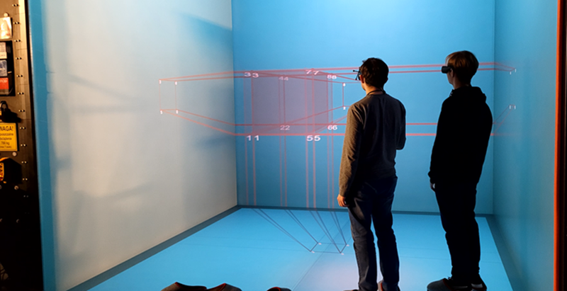
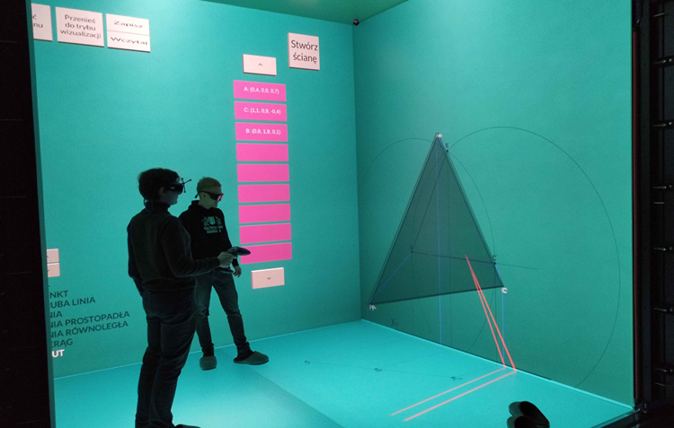
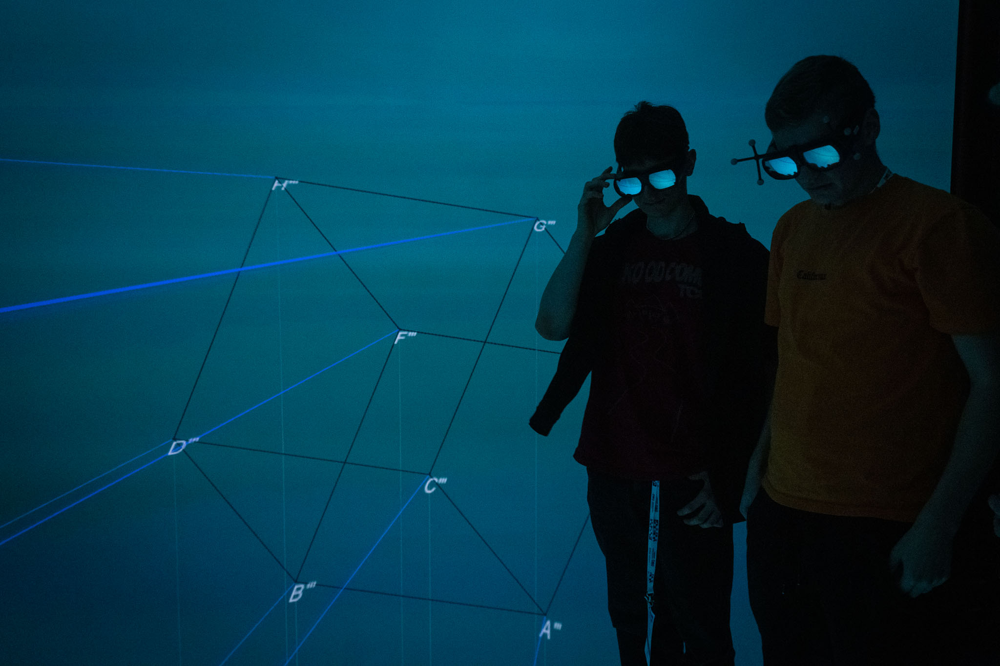
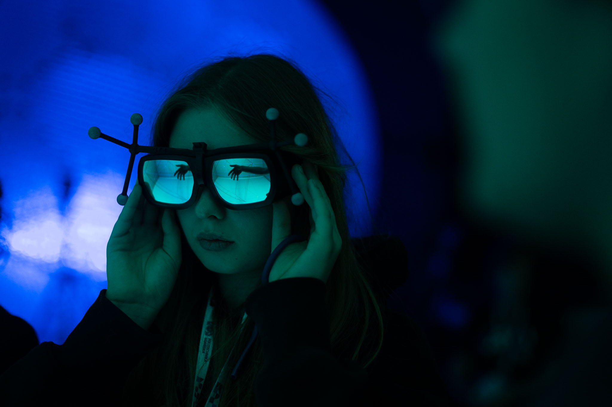

## O Repozytorium

Wymagana wersja Unity: **2018.1.9f2**

| Branch                  | Przeznaczenie                                                                 |
|-------------------------|----------------------------------------------------------------------|
| [`main/`](https://github.com/kosskas/cave/tree/main) | Baza projektu                                             |
| [`dev/`](https://github.com/kosskas/cave/tree/dev)   | Do celów testowych przed scaleniem z main/                                           |
| [`pc/`](https://github.com/kosskas/cave/tree/pc)     | Komputery osobiste                                                 |
| `prv/<user>/*` | Prywatne branche                                           |
| `lzwp/*`                  | VR CAVE, wymagana biblioteka LZWPLib |
| `cave/study/*`     | Wersje użyte do badań w danym dniu                                  |

---

## O Projekcie

Repozytorium [`CAVE`](https://github.com/kosskas/cave/)

---

## Projekt grupowy 2023-2024 -- Przestrzeń rzutowa i metody rzutowania w wirtualnej przestrzeni. Jak powstają rzuty obiektów 3D na płaszczyznę?

Celem projektu jest stworzenie aplikacji, która ułatwi studentom zrozumienie, jak powstają rzuty obiektów 3D na płaszczyznę i wyjaśni geometryczne metody rozwiązywania zadań w przestrzeni. Pomoże ona studentom odróżnić rzut środkowy od równoległego, aksonometrię od perspektywy oraz rozwinie wyobraźnię przestrzenną. Symulacje geometrycznych metod rzutowania obiektów przestrzennych na płaszczyznę rzutni. Wizualizacja tworzenia płaskich obrazów obiektów 3D w czasie rzeczywistym. Wizualizacja konstrukcji geometrycznych wykorzystywanych w badaniu wzajemnych relacji obiektów w przestrzeni.

### Osiągnięte rezultaty w 1 semestrze

Po kliku spotkaniach z klientem udało się doprecyzować wizję tworzonej aplikacji.
Powstał prototyp, umożliwiający importowanie dowolnych obiektów 3D zapisanych w
autorskim formacie .wobj (mocno wzorowanym na .obj). Zaimportowane obiekty
posiadają automatycznie podpisane wierzchołki (zgodnie z ich nazwami ustalonymi w
pliku), które obracają się tak, by użytkownik zawsze mógł je odczytać. Możliwe jest także
obracanie całym obiektem, w celu zaprezentowania jak podczas zmiany położenia
obiektu zmieniają się jego rzuty na płaszczyzny (na ten moment rzuty reprezentowane są
w postaci cieni).

  

  

### Osiągnięte rezultaty w 2 semestrze

Po dwóch semestrach pracy udało się stworzyć aplikację z konkretną, dopracowaną
wizją. Umożliwia ona importowanie dowolnych obiektów 3D i 2D zapisanych w autorskim
formacie .wobj (mocno wzorowanym na .obj). Zaimportowane obiekty posiadają
podpisane wierzchołki zgodnie z ich nazwami ustalonymi w pliku, które obracają się tak,
by użytkownik zawsze mógł je odczytać. Możliwe jest także obracanie całym obiektem,
w celu zaprezentowania jak podczas zmiany położenia obiektu zmieniają się jego rzuty na
płaszczyzny. Użytkownik w każdym momencie ma możliwość włączenia i wyłączenia
widoczności linii rzutujących i odnoszących. Widoczność każdego rzutu też może zostać
włączona lub wyłączona. Istnieje także możliwość zdefiniowania własnych płaszczyzn
rzutowania, definiując na istniejących już płaszczyznach dwa punkty, przez które
przechodzić będzie nowa płaszczyzna. W razie potrzeby, użytkownik może także usunąć
postawione przez siebie płaszczyzny.

  

---

## Projekt inżynierski 2024-2025 -- Rekonstrukcja brył w środowisku VR CAVE na podstawie ich rzutów na zadane płaszczyzny

Celem projektu jest wykonanie aplikacji dla jaskiń rzeczywistości wirtualnej w Laboratorium Zanurzonej Wizualizacji Przestrzennej, które pozwolą na prezentację w przestrzeni trójwymiarowej zadanych płaszczyzn rzutni wraz z rzutami i następnie nadzorowane przez użytkownika odtworzenie wyglądu bryły. Aplikacja ta, dzięki współpracy z Wydziałem Architektury PG, powinna w przyszłości wspomóc kształtowanie wyobraźni przestrzennej u studentów uczęszczających na przedmiot „Geometria wykreślna”.

### Osiągnięte rezultaty

Po dwóch semestrach pracy nad aplikacją udało się stworzyć kompleksowe narzędzie umożliwiające wykonywanie części ćwiczeń, które są realizowane w ramach przedmiotu Geometria Wykreślna. Program umożliwia definiowanie elementów konstrukcyjnych takich jak rzut punktu, rzut odcinka, linie pomocnicze, okręgi pomocnicze, a także budowanie ścian w zrekonstruowanych bryłach. Zaimplementowano zautomatyzowane stopniowe odtwarzanie obiektu w przestrzeni w miarę postępu rysowania jego rzutów. Aplikacja wspiera użytkownika w procesie konstruowania, wyświetlając linie pomocnicze. Umożliwia także zapisywanie stanu sceny oraz późniejsze jego wznowienie. Opracowane rozwiązanie pozwala przenosić zrekonstruowane bryły do aplikacji z projektu grupowego.

  

---

## Projekt badawczy 2025-2026 -- Badania skuteczności edukacyjnej rzeczywistości wirtualnej w nauczaniu geometrii wykreślnej

Celem projektu jest przeprowadzenie z udziałem studentów różnych kierunków dogłębnych badań dotyczących skuteczności edukacyjnej aplikacji opracowanej z myślą o wsparciu procesu nauczania geometrii wykreślnej dla jaskiń rzeczywistości wirtualnej dostępnych w Laboratorium Zanurzonej Wizualizacji Przestrzennej.

### Osiągnięte rezultaty w 1 semestrze

Przygotowanie i prezentacja plakatu na X Ogólnopolską Konferencję Dydaktyki Akademickiej „Ideatorium” [LINK](https://www.youtube.com/embed/GwgsnDwxPkQ).

### Osiągnięte rezultaty w 2 semestrze

Badanie użyteczności i wrażeń z aplikacji podczas wydarzenia [Politechnika Talentów](https://pg.edu.pl/aktualnosci/2025-09/przedsmak-studiow-na-pg-za-nami-politechnika-talentow).

  

---

## Praca magisterska 2025-2026 -- Kompleksowa analiza możliwości wykorzystania rzeczywistości wirtualnej w kształtowaniu wyobraźni przestrzennej dla potrzeb przedmiotu akademickiego Geometria wykreślna

Celem pracy jest zbadanie na grupie przynajmniej 128 osób (studentów I roku kierunków, na których wymagana jest wyobraźnia przestrzenna), możliwości kształtowania wyobraźni przestrzennej w wyniku użytkowania specjalnie przygotowanej przy współpracy z adiunktem prowadzącym przedmiot Geometria wykreślna aplikacji rzeczywistości wirtualnej do wykonywania zadań przewidzianych w programie tego przedmiotu akademickiego. Badania prowadzone byłyby w jaskini rzeczywistości wirtualnej dostępnej w Laboratorium Zanurzonej Wizualizacji Przestrzennej.

---